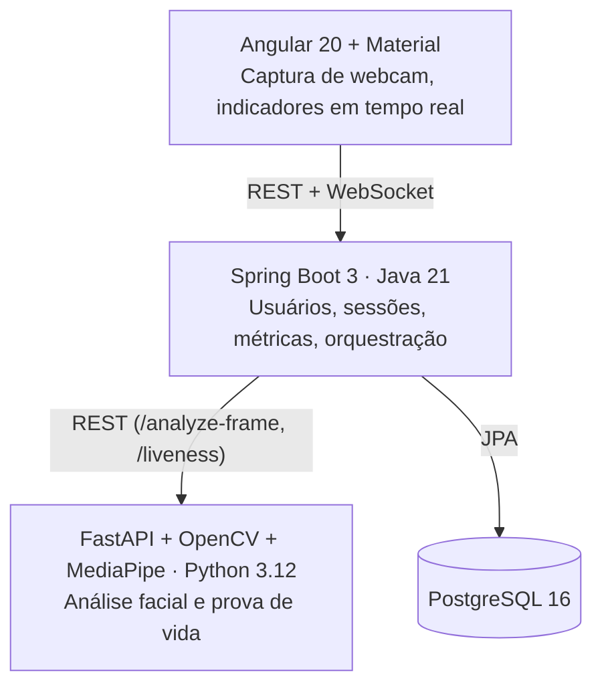

# iFood entregador

Hoje vim apresentar um projeto pessoal que nasceu de uma dor real de quem entrega pelo iFood.                            O contexto: antes, o iFood não tinha nenhuma forma de certificar que quem estava fazendo a entrega era realmente o titular da conta. Resultado: era comum titulares emprestarem ou até alugarem a conta pra terceiros — você fazia um pedido, no app aparecia "Joana", mas quem chegava era o João. Pra resolver isso, o iFood implementou o reconhecimento facial: todo dia, na primeira entrega da rotina, o app pede a verificação.                                               O problema: o reconhecimento falha com frequência. Eu mesmo já tive dias de precisar tentar 5, 10, até 15 vezes pra conseguir. E o pior não é falhar — é não saber por quê. O app enquadra o rosto, captura, processa... e devolve só um "Vamos tentar novamente" genérico, sem indicar se foi a luz, o enquadramento, a distância ou o quê.               
O que eu construí: uma interface inspirada no app do entregador iFood, onde o processo de reconhecimento facial analisa em tempo real brilho, nitidez, distância, enquadramento e presença de rosto único — mostrando pro usuário exatamente o que precisa ajustar antes de capturar a imagem, em vez de um erro genérico no final.                                
Uma sugestão extra pra reduzir ainda mais esse atrito seria incluir uma prova de vida em vídeo (pedindo pra virar o rosto pra direita e pra esquerda), capturando mais detalhes e comparando com a foto do cadastro — reforçando a segurança sem depender só de uma foto estática.                                                 

## Arquitetura



| Camada | Responsabilidade |
|---|---|
| **Angular** | Captura de vídeo da webcam, overlay da bounding box, indicadores tipo semáforo, fluxo guiado de prova de vida, dashboard. |
| **Spring Boot** | Usuários, sessões, métricas, proxy para o vision-service, WebSocket em tempo real, cálculo de estabilidade (jitter entre frames), agregações do dashboard, export CSV, logs estruturados. |
| **Vision Service** | Toda a análise de imagem: brilho/contraste/nitidez via OpenCV, detecção de rosto e landmarks via MediaPipe, estimativa de yaw via `cv2.solvePnP` para a prova de vida. |

### Por que a "estabilidade" é calculada no backend, não no vision-service

Cada chamada a `/analyze-frame` analisa **um frame isolado**. Estabilidade é, por definição, uma
métrica **temporal** (o quanto o rosto treme entre frames consecutivos) — por isso ela é
calculada no Spring Boot, que é a camada que enxerga o *stream* de frames de uma sessão via
WebSocket (`CaptureWebSocketHandler` + `StabilityCalculator`, uma janela deslizante das últimas
posições do centro do rosto).

## Fluxo de uma sessão

1. Usuário informa nome/e-mail (sem senha — apenas para agrupar sessões) → `POST /api/users`.
2. Frontend abre uma sessão → `POST /api/sessions` (status `PENDING`).
3. Frontend conecta no WebSocket `/ws/capture?sessionId=...` e envia um frame JPEG em base64 a
   cada ~600ms. O backend repassa cada frame para `POST /analyze-frame` no vision-service, soma o
   cálculo de estabilidade e devolve tudo no mesmo socket.
4. Quando a pontuação atinge o mínimo (60), o usuário avança para a prova de vida: olhe para
   frente → vire à esquerda → volte ao centro → vire à direita → volte ao centro. Os frames de
   cada fase são acumulados no navegador e enviados de uma vez para
   `POST /api/liveness/verify`, que repassa para `POST /liveness` no vision-service.
5. O frontend conclui a sessão em `POST /api/sessions/{id}/complete`, enviando o último snapshot
   de qualidade + o resultado da prova de vida. O backend decide `PASSED`/`FAILED`
   (`score >= 70` **e** prova de vida concluída), persiste a métrica e transmite um evento para
   quem estiver ouvindo `/ws/dashboard`.

## Tecnologias

- **Backend:** Java 21, Spring Boot 3, Spring Web, Spring Data JPA, Spring WebSocket, PostgreSQL, virtual threads.
- **Frontend:** Angular 20 (standalone components, novo *control flow* `@if`/`@for`, signals), Angular Material (tema escuro M3), RxJS.
- **Visão computacional:** Python 3.12, FastAPI, OpenCV, MediaPipe (Face Detection + Face Mesh), NumPy.
- **Infra:** Docker, Docker Compose.

## Estrutura de pastas

```
.
├── docker-compose.yml
├── backend/            # Spring Boot (Java 21)
│   └── src/main/java/com/biometric/capture/{config,domain,repository,dto,service,controller,websocket,exception}
├── vision-service/      # FastAPI (Python 3.12)
│   └── app/{api,core,services,schemas,utils}
└── frontend/            # Angular 20 + Material
    └── src/app/{core/{models,services},pages/{home,capture,dashboard,about},components/*}
```

## Endpoints

### vision-service (porta 8000)

| Método | Rota | Descrição |
|---|---|---|
| POST | `/analyze-frame` | Recebe `{ image: base64 }`, retorna qualidade do frame (brilho, nitidez, contraste, distância, enquadramento, score, warnings). |
| POST | `/liveness` | Recebe `{ frames: [base64, ...] }`, retorna se a sequência centro→lado→centro→lado→centro foi cumprida. |
| GET | `/health` | Healthcheck. |

### backend (porta 8080)

| Método | Rota | Descrição |
|---|---|---|
| POST | `/api/users` | Cria (ou retorna, se o e-mail já existe) um usuário. |
| GET | `/api/users`, `/api/users/{id}` | Lista/consulta usuários. |
| POST | `/api/sessions` | Inicia uma sessão (`PENDING`). |
| POST | `/api/sessions/{id}/complete` | Conclui a sessão com o snapshot de qualidade final. |
| GET | `/api/sessions`, `/api/sessions/{id}` | Histórico / detalhe de sessões. |
| GET | `/api/sessions/export` | Exporta o histórico em CSV. |
| POST | `/api/liveness/verify` | Encaminha a prova de vida ao vision-service. |
| POST | `/api/analysis/frame` | Fallback REST de `/analyze-frame` (fora do WebSocket). |
| GET | `/api/dashboard/stats` | Totais, qualidade média, tempo médio, falhas por categoria, evolução diária. |
| GET | `/api/dashboard/ranking` | Ranking de usuários por qualidade média. |
| WS | `/ws/capture?sessionId=` | Canal de análise de frame em tempo real. |
| WS | `/ws/dashboard` | Notifica quando uma sessão é concluída. |

## Executando com Docker (recomendado)

```bash
docker compose up --build
```

- Frontend: http://localhost:4200
- Backend: http://localhost:8080 (`/actuator/health`)
- Vision service: http://localhost:8000/health
- Postgres: `localhost:5433` (db `biometric_capture`, user/senha `biometric`/`biometric`; a porta do
  host é `5433` para não conflitar com uma instalação local de Postgres na `5432` — internamente os
  containers continuam se comunicando na porta `5432`)

## Executando localmente (sem Docker)

**vision-service**
```bash
cd vision-service
python -m venv .venv && . .venv/Scripts/activate   # ou source .venv/bin/activate no Linux/Mac
pip install -r requirements-dev.txt
uvicorn app.main:app --reload --port 8000
```

**backend** (requer Postgres rodando localmente, ou ajuste `DB_*` em `application.yml`)
```bash
cd backend
mvn spring-boot:run
```

**frontend**
```bash
cd frontend
npm install
npm start   # usa proxy.conf.json para redirecionar /api e /ws para localhost:8080
```

## Testes

| Camada | Ferramentas | Comando |
|---|---|---|
| Backend | JUnit 5, Mockito, AssertJ, H2 (`@DataJpaTest`) | `cd backend && mvn test` |
| Vision service | Pytest | `cd vision-service && pip install -r requirements-dev.txt && pytest` |
| Frontend | Jasmine, Karma | `cd frontend && npm test -- --watch=false` |

## Decisões arquiteturais (resumo)

- **Sem autenticação/login**: a tabela `users` não tem senha — o frontend cria/seleciona um
  usuário (guardado em `localStorage`) só para agrupar sessões.
- **`ddl-auto: update`** no Hibernate, sem Flyway/Liquibase, para manter o escopo enxuto — troque
  por uma ferramenta de migração antes de qualquer uso em produção real.
- **WebSocket nativo do Spring** (sem STOMP/SockJS) para o canal de captura, mantendo o
  protocolo simples: uma mensagem = um frame = um resultado.
- **Prova de vida em lote via REST**, não streaming: o navegador guia o usuário por um roteiro
  fixo de tempo, acumula os frames de cada fase e manda tudo de uma vez para verificação — mais
  simples e mais fácil de testar do que manter estado de gesto no servidor via WebSocket.
- **Gráfico de evolução em SVG nativo** (sem biblioteca de terceiros), para não depender de uma
  lib de charts ainda sem suporte oficial ao Angular 20 recém-lançado.
- **Logs estruturados**: `key=value` no backend (Logback + MDC com `sessionId`), JSON por linha
  no vision-service (formatter customizado em `app/core/logging.py`).
- **MediaPipe Tasks API, não a API legada `mp.solutions`**: o wheel do `mediapipe` para Python
  3.12 não inclui mais `mp.solutions.face_detection`/`face_mesh` — só a API nova
  (`mediapipe.tasks.python.vision.FaceDetector`/`FaceLandmarker`), que exige baixar os modelos
  `.tflite`/`.task` separadamente. O `Dockerfile` do vision-service já baixa esses modelos no
  build (`/app/models`); `app/core/models.py` também baixa sob demanda para quem rodar
  `pytest`/`uvicorn` localmente sem Docker.
- **`RestClient` do backend fixado em HTTP/1.1**: o `java.net.http.HttpClient` (usado por padrão
  pelo Spring 6.1+ `RestClient`) tenta um upgrade h2c em toda conexão `http://`; o uvicorn (ASGI
  do vision-service) não suporta esse upgrade e descartava o corpo da requisição
  silenciosamente, fazendo todo `POST /analyze-frame`/`POST /liveness` chegar vazio no FastAPI
  (erro 422 "body: null"). Foi encontrado validando a stack via Docker — corrigido fixando
  `HttpClient.Version.HTTP_1_1` em `RestClientConfig`.

## Roadmap

- [ ] Migrações versionadas (Flyway) no lugar de `ddl-auto: update`.
- [ ] Autenticação real (JWT) se o projeto evoluir para múltiplos operadores/tenants.
- [ ] Métricas de negócio expostas via Micrometer/Prometheus.
- [ ] Suporte a upload de vídeo curto (em vez de apenas stream ao vivo) para a prova de vida.
- [ ] Internacionalização do frontend (hoje só em pt-BR).
- [ ] Screenshots reais da aplicação em execução (este README documenta a arquitetura e o fluxo;
      capturas de tela devem ser adicionadas em `docs/` após a primeira execução local, já que
      este ambiente de desenvolvimento não tem um navegador com interface gráfica disponível
      para gerar imagens).
